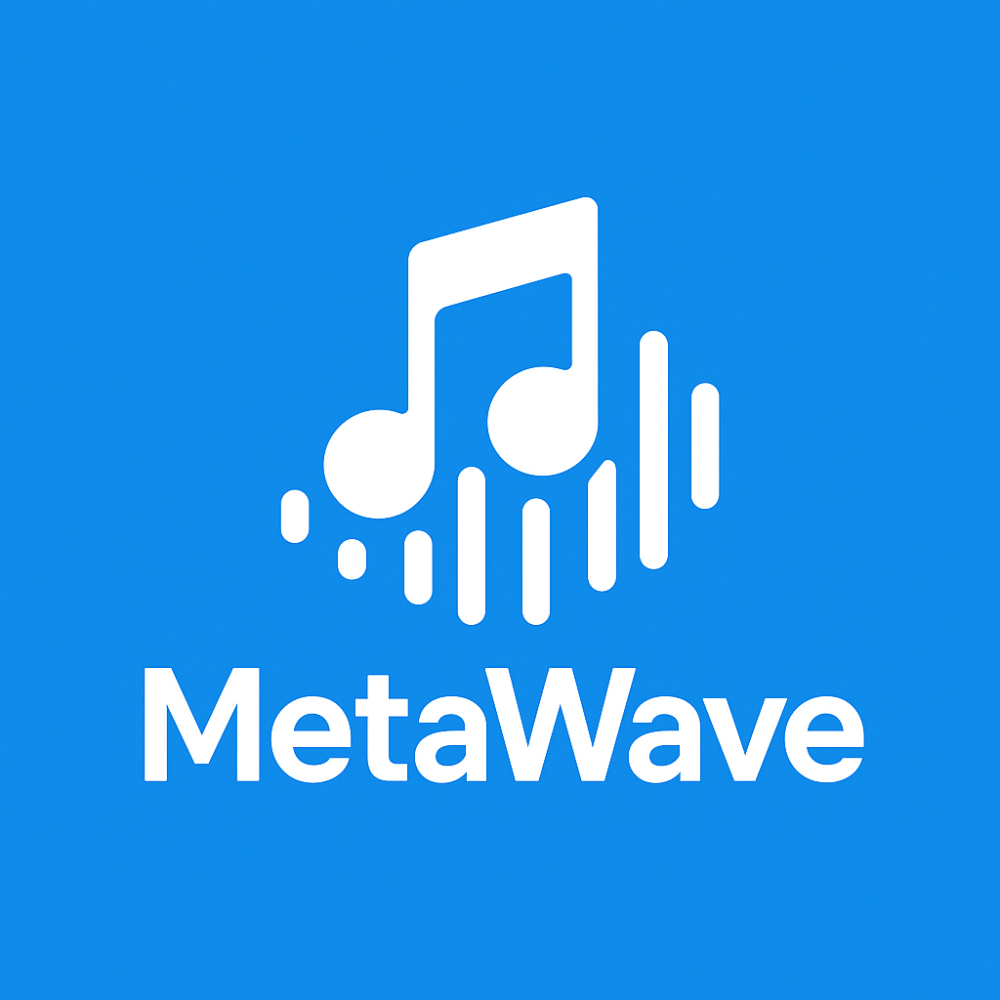
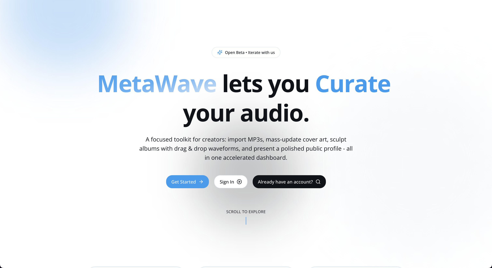
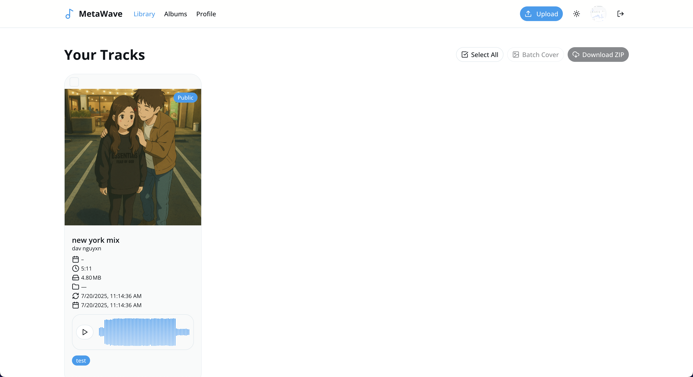
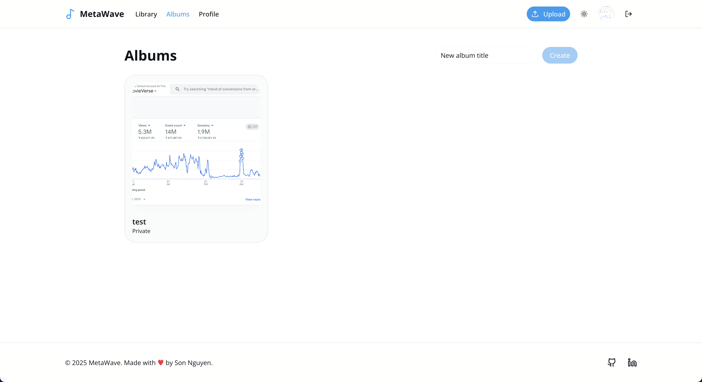
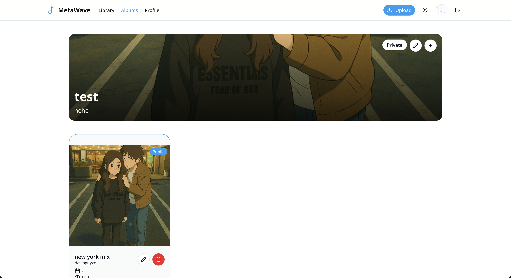
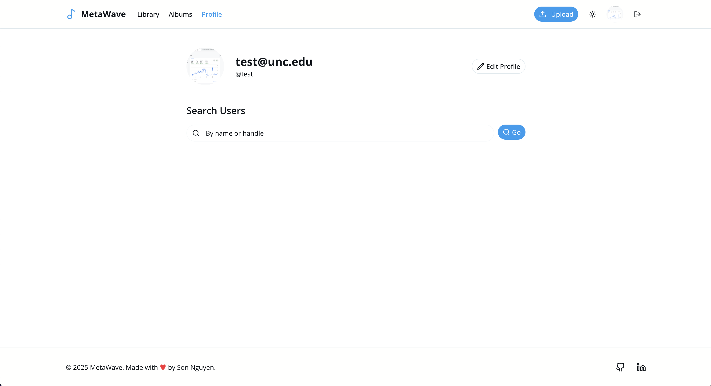
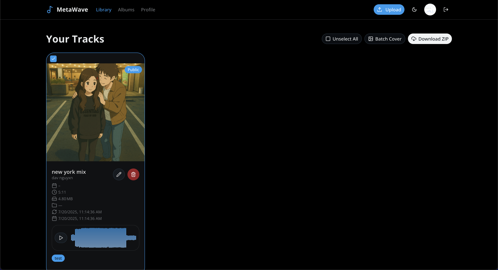
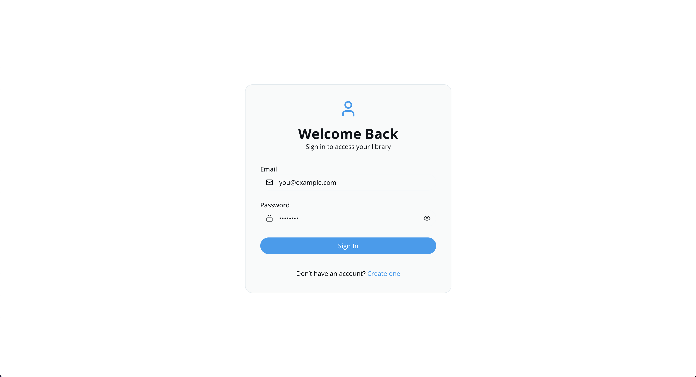
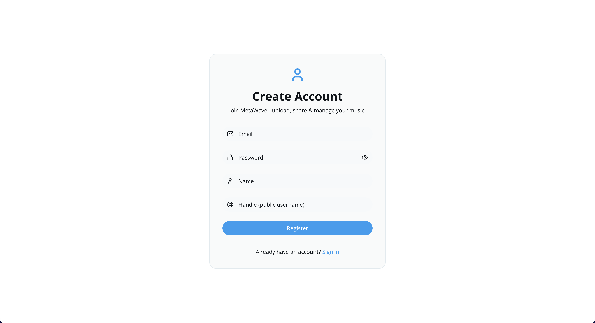
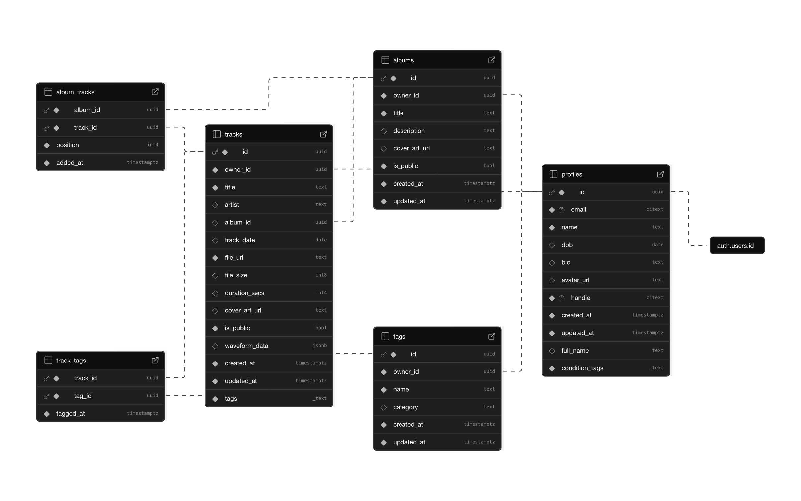

# 🎵 **MetaWave – A Modern Personal Music Library & Sharing Hub**

**MetaWave** lets independent artists & collectors **upload MP3s, embed / replace cover art, batch update artwork, organize tracks into drag‑sortable albums, manage rich metadata, and share public profiles** – all in a sleek, fast, theme‑aware UI.

_Think: “A lightweight self‑hosted mini streaming console + curator workspace” built on an audibly opinionated stack._ ⚡

<p align="center">
  
</p>

> [!IMPORTANT]
> Born from the pain of juggling loose MP3s, stale cover images, and chaotic folder naming. **MetaWave** centralizes your personal catalog while feeling _instant_ and polishing the small UX edges.


## 📑 Table of Contents

1. [About MetaWave](#-about-metawave)
2. [Core Features](#-core-features)
3. [Albums & Drag Architecture](#-albums--drag-architecture)
4. [Track Metadata & Artwork Pipeline](#-track-metadata--artwork-pipeline)
5. [Tech Stack](#-tech-stack)
6. [UI / UX Highlights](#-ui--ux-highlights)
7. [User Interface](#-user-interface)
8. [Data Model](#-data-model)
   - [Tables](#tables)
   - [Schema](#schema)
9. [Getting Started](#-getting-started)
10. [Environment Variables](#-environment-variables)
11. [Development Scripts](#-development-scripts)
12. [Batch Artwork Updating](#-batch-artwork-updating)
13. [Accessibility & Theming](#-accessibility--theming)
14. [Performance Techniques](#-performance-techniques)
15. [Security & Validation](#-security--validation)
16. [AWS Deployment](#-aws-deployment)
    - [Ansible & Terraform](#ansible--terraform)
17. [Docker & Containerization](#-docker--containerization)
    - [DevContainer](#devcontainer)
18. [Testing & Quality Assurance](#-testing--quality-assurance)
19. [Makefile & Shell Scripts](#-makefile--shell-scripts)
20. [Contributing](#-contributing)
21. [License](#-license)
22. [Author](#-author)

## 🪄 About MetaWave

**MetaWave** is a self‑managed music library & micro‑publishing interface for indie creators:

| Pain Before                            | MetaWave Solution                                            |
| -------------------------------------- | ------------------------------------------------------------ |
| Folders full of inconsistent MP3 names | Canonical metadata fields & controlled edit modals           |
| No cover / outdated cover art          | Inline single & batch cover uploads via Supabase Storage     |
| Manual track order headaches           | Drag & drop ordering saved positionally per album            |
| Sharing zip attachments                | Public profile + album visibility toggle                     |
| Bland wave progress bars               | Adaptive (theme‑aware) waveform canvases with dynamic colors |

Use it to **curate demos**, **bundle thematic EP drops**, **share works-in-progress** with friends, or just **tame the chaos** of personal recordings.

> [!CAUTION]
> Due to Supabase's current limitations, **MetaWave does not allow files larger than 10MB**. This is a temporary constraint until we can implement a more robust file handling solution.

## ✨ Core Features

MetaWave is designed to be a **fast, responsive, and intuitive** music library management tool with the following core features:

| Category               | Highlights                                                                                                      |
| ---------------------- | --------------------------------------------------------------------------------------------------------------- |
| **Auth & Profiles**    | Supabase Auth, profile trigger creation, avatar upload (buckets/avatars), handle validation (`^[a-zA-Z0-9_]+$`) |
| **Profile Editing**    | Modal form w/ Zod + react-hook-form, avatar preview, copy public profile link                                   |
| **User Search**        | ILIKE name/handle query with fast, trimmed results + skeleton states                                            |
| **Tracks**             | Upload (external flow), edit title, artist, release date, public flag, cover art, waveform visualization        |
| **TrackCard**          | Dynamic metadata panel (date, duration, file size) + lucide iconography, hover tool cluster                     |
| **Albums**             | Hero cover, gradient overlay, fallback “generated” placeholder (icon + neutral gradient)                        |
| **Reordering**         | dnd-kit sortable grid (react-spring-free), position updates persisted incrementally                             |
| **Batch Cover**        | Select N tracks → apply a shared cover in one go with progress feedback                                         |
| **ZIP Export**         | Arbitrary selection of tracks → zipped client-side via JSZip                                                    |
| **Theming**            | Light / Dark / System dropdown toggle (localStorage + prefers-color-scheme)                                     |
| **Skeleton Loading**   | Consistent skeletons for library grids, user lists, hero areas                                                  |
| **Validation**         | Zod on all mutations: tracks, profiles, albums; typed supabase operations                                       |
| **Feedback**           | Sonner toasts for success/failure + optimistic UI hints                                                         |
| **Drag Grid Adaptive** | Max 4 columns large → scale down responsively; left-aligned on wide canvases                                    |
| **Access Control**     | Public / private toggles per track & album (future gating)                                                      |

## 🗃 Track Metadata & Artwork Pipeline

MetaWave's track management is designed to be intuitive and efficient, allowing users to easily manage their audio files and associated metadata. The process involves several key steps:

| Step               | Details                                                                                                                                       |
| ------------------ | --------------------------------------------------------------------------------------------------------------------------------------------- |
| File Upload        | Track initial file (MP3) uploaded elsewhere (upload page) → gets `file_url`, `file_size`, optional `duration_secs` (or recomputed)            |
| Cover Art (single) | User picks image → stored at `covers/{owner_id}/covers/{uuid}-{filename}` bucket                                                              |
| Batch Cover        | Loop selected tracks, push same image under unique path per track (or reuse identical URL)                                                    |
| Duration           | If missing, `<Audio>` preloads metadata → updates local display (without extra server write)                                                  |
| Editing            | Dialog with controlled inputs + file watchers; `updateTrack` Zod gate ensures shape                                                           |
| Validation         | Title required, artist optional, date optional, boolean public flag, safe fallback defaults                                                   |
| Waveform           | Rendered with WaveSurfer.js, using `file_url` for audio source, dynamic colors based on theme toggle.                                         |
| Waveform Colors    | On mount + theme change, new WaveSurfer instance with explicit `waveColor` & `progressColor` (no CSS vars that break canvas gradient parsing) |
| Waveform Memory    | `unAll()` + `destroy()` + abort rejection swallow to prevent memory leaks                                                                     |
| and more...        | More features like drag-and-drop reordering, batch cover updates, and adaptive waveforms enhance the user experience.                         |

## 🧱 Tech Stack

MetaWave is built on a modern, robust stack that leverages the latest technologies to provide a seamless user experience. Here’s a breakdown of the key components:

| Layer                   | Stack                                                                          |
| ----------------------- | ------------------------------------------------------------------------------ |
| **Framework**           | Next.js 15 + React 18 + (Pages routing in current snapshot)                    |
| **Language**            | TypeScript end‑to‑end                                                          |
| **Auth / DB / Storage** | Supabase (Postgres + Auth + S3-like buckets)                                   |
| **Styling**             | Tailwind CSS + shadcn/ui primitives                                            |
| **Drag & Drop**         | dnd-kit core + sortable                                                        |
| **Forms**               | react-hook-form + Zod resolver                                                 |
| **Validation**          | Zod schemas for queries & profile / track / album types                        |
| **Icons**               | Lucide-react                                                                   |
| **Waveforms**           | WaveSurfer.js (canvas gradient color logic + theme adaptation)                 |
| **Feedback**            | Sonner minimal toast notifications                                             |
| **Bundling/Deploy**     | Vercel (typical) or custom container                                           |
| **Utilities**           | JSZip, uuid, Next Themes alternative (manual theme toggle)                     |
| **Lint/Format**         | ESLint + Prettier                                                              |
| **Testing**             | Jest (unit tests) + Playwright (E2E planned)                                   |
| **CI/CD**               | GitHub Actions for automated workflows                                         |
| **Containerization**    | Docker (for local dev + production)                                            |
| **Infrastructure**      | Ansible + Terraform for provisioning (with AWS)                                |
| **Deployment**          | Vercel for frontend, Supabase for backend, AWS for enhanced deployment options |

## 🖥 UI / UX Highlights

MetaWave's UI is designed to be **fast, responsive, and intuitive**, with a focus on user experience. Here are some key highlights:

- **Animated Landing Hero**: Gradient backgrounds, typing / rotating text (planned), CTA emphasis.
- **Hero Album Section**: Contrast-preserving overlay with dynamic gradient fallback if no cover.
- **Card Micro‑Interactions**: Hover borders, shadow elevation, icon actions fade-in (opacity group revealing).
- **Input Styling**: Soft focus shadows + accessible ring for clarity.
- **Adaptive Waveforms**: Theme toggle triggers waveform recolor; fallback placeholder while loading.
- **Grid Strategy**: Strict max of 4 columns large; preserves card width legibility.
- **Progress-less Upload**: Lean immediate preview with object URL pre-insert for covers & avatars.
- **Skeleton Consistency**: Uniform radii + brand tinted neutral backgrounds for perceived speed.
- **Accessible Labels**: Every dialog field labeled (name, handle, dates, etc.).

MetaWave aims to provide a polished, cohesive experience that feels both modern and familiar, with a focus on usability and accessibility.

## ✨ User Interface

### Landing Page

<p align="center">
  
</p>

### Library View

<p align="center">
  
</p>

### Albums List

<p align="center">
  
</p>

### Album Detail

<p align="center">
  
</p>

### Profile Page

<p align="center">
  
</p>

### Dark Mode

<p align="center">
  
</p>

### Login Page

<p align="center">
  
</p>

### Signup Page

<p align="center">
  
</p>

## 🗄 Data Model

MetaWave's data model is designed to be simple yet effective, focusing on user profiles, tracks, albums, and their relationships. The current version includes the following tables:

### Tables

| Table          | Description                                                           |
| -------------- | --------------------------------------------------------------------- |
| `profiles`     | User profile information (name, handle, avatar URL)                   |
| `tracks`       | Track metadata (title, artist, release date, file URL, cover art URL) |
| `albums`       | Album metadata (title, cover art URL, public flag)                    |
| `album_tracks` | Join table linking tracks to albums with position for drag reordering |
| `track_tags`   | Future tagging system for tracks (mood, genre)                        |
| `tags`         | Tag definitions (name, color)                                         |

### Schema

<p align="center">
  
</p>

For more details on the schema, refer to the [`database` directory](database), where you can find the SQL migration files and schema definitions.

## 🚀 Getting Started

To get started with MetaWave, follow these steps:

```bash
git clone https://github.com/your-user/metawave.git
cd metawave

# Install
npm install

# Copy env
cp .env.local.example .env.local
# Fill with: NEXT_PUBLIC_SUPABASE_URL, NEXT_PUBLIC_SUPABASE_ANON_KEY

# Dev
npm run dev
# http://localhost:3000
```

If using Supabase locally:

```bash
supabase start
# Add SQL schema (profiles, tracks, albums, album_tracks)
```

## 🔐 Environment Variables

MetaWave requires several environment variables to function correctly. Create a `.env.local` file in the root directory and populate it with the following variables:

| Variable                        | Required          | Description                    |
| ------------------------------- | ----------------- | ------------------------------ |
| `NEXT_PUBLIC_SUPABASE_URL`      | ✅                | Supabase project URL           |
| `NEXT_PUBLIC_SUPABASE_ANON_KEY` | ✅                | Public client key              |
| `SUPABASE_SERVICE_ROLE_KEY`     | ❌ (server tasks) | Reserved future server scripts |
| `NEXT_PUBLIC_APP_NAME`          | ❌                | Branding override              |
| `NEXT_PUBLIC_DEBUG_WAVE`        | ❌                | Log waveform lifecycle (dev)   |

> [!WARNING]
> Never expose the service role key client-side.

## 🧪 Development Scripts

MetaWave includes several npm scripts to streamline development and deployment:

| Script   | Purpose                       |
| -------- | ----------------------------- |
| `dev`    | Start Next.js dev server      |
| `build`  | Production build              |
| `start`  | Run production build          |
| `lint`   | ESLint check (only in root)   |
| `format` | Prettier write (only in root) |
| `test`   | Run Jest tests                |

Feel free to add more scripts as needed, such as for database migrations or custom build steps.

## 🖼 Batch Artwork Updating

We've implemented a **Batch Cover Dialog** to streamline the process of updating cover art for multiple tracks at once. This feature is designed to enhance user experience by allowing quick updates without needing to edit each track individually.

1. Select tracks (checkbox overlay on library grid)
2. Open **Batch Cover Dialog**
3. Upload single image → stored once per track path (ensures unique paths, optional dedupe later)
4. Update each track row `cover_art_url` sequentially (could be parallel batched in future)
5. Success toast + local reload

Future enhancements:

- Parallel `Promise.allSettled`
- MD5 hashing to avoid duplicate uploads

## ♿ Accessibility & Theming

MetaWave is built with accessibility and theming in mind, ensuring a consistent and inclusive user experience across different devices and preferences. Here are some key aspects:

| Aspect         | Implementation                                                                           |
| -------------- | ---------------------------------------------------------------------------------------- |
| Focus states   | Tailwind focus ring + outline none override                                              |
| Labels         | All modal fields labeled with `<Label>` or `sr-only`                                     |
| Color contrast | Album hero gradient overlay ensures readable text even with bright covers                |
| Theme toggle   | Dropdown (light / dark / system) persisting to `localStorage` with system watch fallback |
| Icons          | Semantically adjacent (edit pencil, trash for destructive, calendar for date)            |
| Waveforms      | Dynamic colors based on theme toggle; fallback placeholder while loading                 |
| Skeletons      | Consistent radii + brand tinted neutral backgrounds for perceived speed                  |

## ⚙ Performance Techniques

MetaWave employs several performance techniques to ensure a smooth user experience, especially when dealing with large libraries and media files. Here are some key strategies:

| Technique                             | Benefit                                                                              |
| ------------------------------------- | ------------------------------------------------------------------------------------ |
| Conditional re-fetch after edits only | Avoid redundant network on every UI state change                                     |
| Skeleton placeholders                 | Perceived performance for heavy lists                                                |
| Local optimistic reorder              | Drag reorder immediate UI feedback                                                   |
| Lazy audio metadata extraction        | No blocking DB writes for duration                                                   |
| Narrow select queries                 | e.g. `select id,name,handle,avatar_url` for user search instead of `*`               |
| Controlled state resets               | Clearing selection set after album reload prevents stale UI                          |
| Waveform caching                      | Reuse existing waveforms on re-render to avoid re-fetching                           |
| Waveform memory management            | `unAll()` + `destroy()` to prevent memory leaks                                      |
| Client-side caching                   | Use `useSWR` for profiles, albums, and tracks to minimize fetches                    |
| Image optimization                    | Use Next.js `<Image>` component for automatic resizing and lazy loading              |
| Server-side rendering (SSR)           | Initial page load performance with pre-rendered HTML                                 |
| Client-side caching                   | Use `useSWR` for profiles, albums, and tracks to minimize fetches                    |
| Indexing & pagination                 | Use database indexing and pagination for large datasets to improve query performance |

## 🔒 Security & Validation

MetaWave takes security and data integrity seriously, implementing several layers of validation and access control:

| Layer             | Approach                                                                       |
| ----------------- | ------------------------------------------------------------------------------ |
| Input             | Zod schemas (profiles, albums, tracks)                                         |
| Storage paths     | Namespaced by user (`{user_id}/avatars`, `{owner_id}/covers/`)                 |
| Public vs Private | `is_public` flags on tracks & albums gating future list endpoints              |
| Client            | Never stores service keys or privileged tokens                                 |
| Ref Safety        | Optional chaining & fallback placeholders to mitigate runtime undefined errors |
| File Type         | `accept="image/*"` plus (future) server MIME enforcement                       |
| File Size         | Supabase storage limits (10MB max) enforced on upload                          |
| Auth              | Supabase Auth for user management, profile creation, and secure access control |
| Rate Limiting     | Future implementation to prevent abuse (e.g., too many uploads)                |
| Data Integrity    | Use of UUIDs for unique identifiers, ensuring no collisions in storage paths   |
| Error Handling    | Sonner toasts for user feedback on success/failure, with clear error messages  |

## 🗺 AWS Deployment

We also provide an optional **AWS deployment** setup for those who prefer a more robust infrastructure. This includes:

- **Ansible** for provisioning and configuration management.
- **Terraform** for infrastructure as code, allowing you to define your AWS resources declaratively.
- **Docker** for containerization, ensuring consistent environments across development and production.
- **Nginx** as a reverse proxy for serving the Next.js application and handling static assets.
- **GitHub Actions** for CI/CD, automating the build and deployment process.

For detailed instructions on setting up the AWS deployment, refer to the [AWS Deployment Guide](docs/aws-deployment.md).

### Ansible & Terraform

MetaWave uses **Ansible** and **Terraform** to automate the deployment process on AWS. This allows for easy provisioning of resources, configuration management, and infrastructure as code.

Ansible is used for:

- Setting up the server environment (e.g., installing dependencies, configuring Nginx).
- Deploying the application code to the server.
- Managing server configurations and updates.
- Running database migrations and other setup tasks.
- Automating routine maintenance tasks.
- Configuring security groups, firewalls, and other network settings.
- Setting up monitoring and logging services.
- Managing SSL certificates for secure HTTPS connections.
- and more...

Terraform is used for:

- Defining and provisioning AWS resources (e.g., EC2 instances, RDS databases, S3 buckets).
- Managing infrastructure as code, allowing for version control and reproducibility.
- Creating reusable modules for common infrastructure patterns.
- Managing dependencies between resources, ensuring they are created in the correct order.
- Handling resource updates and rollbacks in a controlled manner.
- Integrating with other tools and services in the AWS ecosystem.
- Managing state files to track the current state of the infrastructure.

With Ansible and Terraform, you can easily deploy MetaWave to AWS with a few commands, ensuring a consistent and reliable deployment process.

## 🐬 Docker & Containerization

MetaWave can be easily containerized using Docker, allowing for consistent development and production environments. The Docker setup includes:

- A `Dockerfile` for building the application image.
- A `docker-compose.yml` file for orchestrating the application, database, and any other services.
- Environment variables for configuration, similar to the `.env.local` file used in development.
- Volume mounts for persistent storage of uploaded files and database data.
- Health checks to ensure the application is running correctly.

To run MetaWave in a Docker container, follow these steps:

```bash
# Build the Docker image
docker build -t metawave .

# Run the container
docker run -d -p 3000:3000 --env-file .env.local metawave
# Access the application at http://localhost:3000
```

To run MetaWave with Docker Compose, use the provided `docker-compose.yml` file:

```bash
# Start the application with Docker Compose
docker-compose up -d
# Access the application at http://localhost:3000
```

Feel free to customize the Docker setup to fit your deployment needs, such as adding additional services or modifying environment variables.

### DevContainer

For a seamless development experience, MetaWave also supports **DevContainers**. This allows you to run the application in a containerized environment with all dependencies pre-configured. To use the DevContainer setup:

1. Ensure you have [Visual Studio Code](https://code.visualstudio.com/) and the [Remote - Containers extension](https://marketplace.visualstudio.com/items?itemName=ms-vscode-remote.remote-containers) installed.
2. Open the project in VS Code.
3. When prompted, select "Reopen in Container" to start the development environment.
4. Once the container is running, you can use the integrated terminal to run development commands like `npm run dev`.
5. You can also use the VS Code debugger to set breakpoints and debug the application directly within the container.
6. The DevContainer setup includes all necessary tools and configurations, such as Oh My Zsh, Node.js, npm, and the required environment variables, to ensure a smooth development experience.

## 🧪 Testing & Quality Assurance

MetaWave includes a comprehensive testing suite to ensure code quality and functionality. The testing setup consists of:

- **Unit Tests**: Written using Jest, covering core functionality such as track metadata handling, album management, and user profile operations.
- **End-to-End Tests**: _Planned_ using Playwright to simulate user interactions and verify the overall application flow.
- **Continuous Integration**: GitHub Actions configured to run tests on every pull request, ensuring that new changes do not break existing functionality.
- **Code Quality**: ESLint and Prettier are used to enforce coding standards and maintain consistent code style across the project.
- **Test Coverage**: Code coverage reports generated by Jest to identify untested parts of the codebase and ensure comprehensive test coverage.
- **Mocking**: Use of mocking libraries to simulate external dependencies, such as Supabase, during tests to isolate functionality and ensure reliable test results.
- **Snapshot Testing**: Jest snapshot tests for components to catch unexpected changes in the UI.
- **Accessibility Testing**: Accessibility testing tools to ensure compliance with WCAG standards and provide an inclusive user experience.
- **Performance Testing**: Performance tests to measure response times and resource usage under various load conditions.

To run the tests, use the following command:

```bash
cd web
npm run test

# or run in watch mode for continuous testing during development
npm run test:watch

# or generate a coverage report
npm run test:coverage
```

## 🎹 Makefile & Shell Scripts

MetaWave includes a `Makefile` and several shell scripts to simplify common development tasks and automate workflows. The `Makefile` provides a convenient way to run commands without needing to remember complex npm scripts. Here are some key features:

- **Makefile Commands**: Define common tasks such as `make dev`, `make build`, `make lint`, and `make format` to streamline development workflows.
- **Shell Scripts**: Custom shell scripts for tasks like database migrations, environment setup, and deployment automation.
- **Environment Setup**: Scripts to initialize the development environment, including installing dependencies and setting up local configurations.
- **Database Migrations**: Use shell scripts to apply database migrations and ensure the schema is up-to-date.
- **Deployment Automation**: Scripts to automate the deployment process, including building the application, pushing changes to the server, and restarting services.
- **Custom Commands**: Add custom commands to the `Makefile` for specific tasks, such as running tests, generating documentation, or cleaning up temporary files.
- **Cross-Platform Compatibility**: Ensure that the scripts work on both Unix-like systems (Linux, macOS) and Windows, using tools like `cross-env` for environment variable management.
- **Documentation**: Include comments in the `Makefile` and shell scripts to explain each command and its purpose, making it easier for contributors to understand and use.

Example `Makefile` commands:

```bash
# Start the development server
make dev

# Build the production version of the application
make build

# Build Docker image
make docker-build

# Push Docker image to AWS ECR
make docker-push

# Deploy the application
make deploy

# etc.
```

## 🤝 Contributing

Contributions are welcome! If you have ideas for improvements, bug fixes, or new features, please follow these guidelines:

1. **Fork the repository** and create your branch from `master`.
2. **Make your changes** and ensure they pass existing tests.
3. **Commit your changes** with a clear message following the [Conventional Commits](https://www.conventionalcommits.org/en/v1.0.0/) format. Be sure to run `npm run format` to ensure code style consistency.
4. **Push to your fork** and submit a pull request.
5. **Describe your changes** in the pull request description, including any relevant context or screenshots.
6. **Link issues**: If your PR addresses an issue, reference it in the description (e.g., "Fixes #123").
7. **Follow the code style**: Use Prettier for formatting and ESLint for linting. Ensure your code adheres to the project's coding standards.
8. **Test your changes**: If you add new features or fix bugs, please include tests to cover your changes.
9. **Be respectful**: Maintain a positive and constructive tone in discussions and code reviews.
10. **Review process**: Your PR will be reviewed by the maintainers. They may request changes or provide feedback before merging.

> [!TIP]
> Keep commits atomic: _“feat(track-card): add file size & duration metadata block”_.

For bugs: please include **steps**, **expected**, **actual**, and any **console errors** - this helps us reproduce and fix issues quickly.

## 📄 License

**MIT License** – See [LICENSE](LICENSE).

> [!IMPORTANT]
> This project is open source and free to use, but please respect the license terms. Contributions are welcome under the same license. Regardless of use, you MUST credit the original author and provide a link to this project.

## 👨‍💻 Author

Built with _late‑night loops + waveforms_ by **Son Nguyen** in 2025.

- **GitHub:** [@hoangsonww](https://github.com/hoangsonww)
- **LinkedIn:** [linkedin.com/in/hoangsonw](https://www.linkedin.com/in/hoangsonw)
- **Site:** [sonnguyenhoang.com](https://sonnguyenhoang.com)
- **Email:** [hoangson091104@gmail.com](mailto:hoangson091104@gmail.com)

> _“Curate. Polish. Share. Repeat.”_ 🎚️

---

**Enjoy sculpting your catalog with MetaWave.**
_Your music, beautifully organized._ 🎧

[🔝 Back to Top](#-metawave--a-modern-personal-music-library--sharing-hub)
